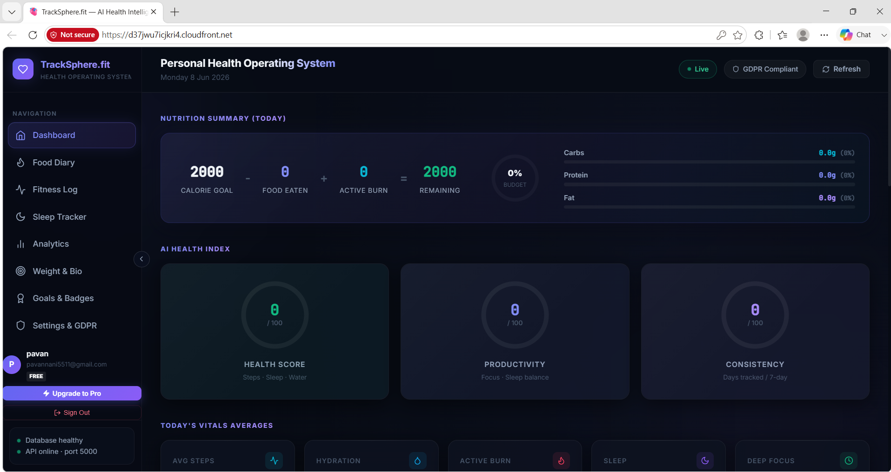
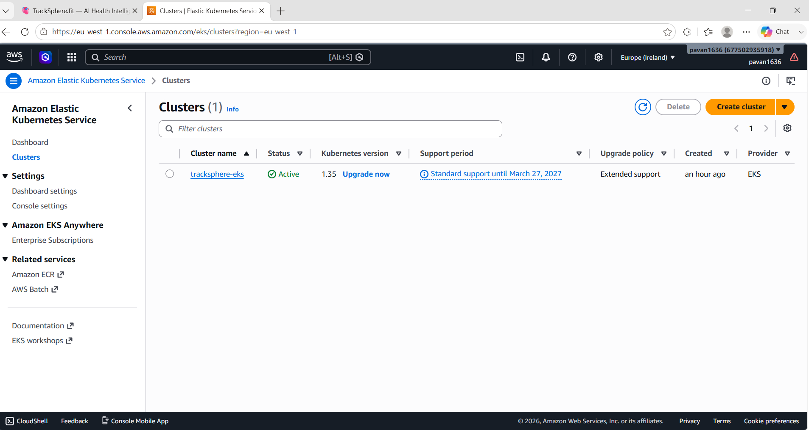
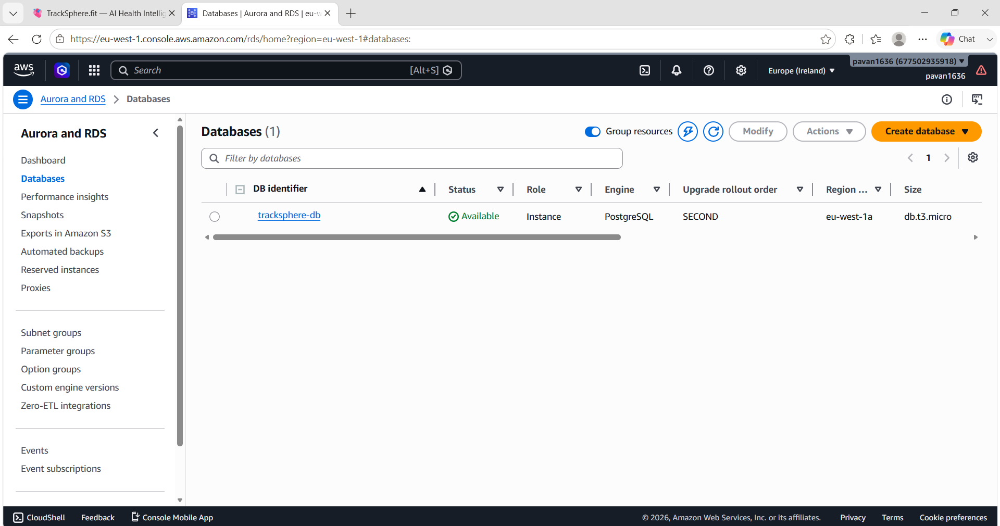

# 🩺 TrackSphere — Full-Stack Health Platform with Production-Grade DevOps

🚀 **Live Production Environment:** **[https://tracksphere.fit](https://tracksphere.fit)**

[](https://tracksphere.fit)

> [!NOTE]
> **Portfolio Repository Scope:** This is the **public DevOps & Infrastructure-as-Code** repository for TrackSphere. It contains the complete Terraform modules, Kubernetes manifests, ArgoCD configuration, and GitHub Actions CI/CD pipelines. The full application source code (React frontend and Node.js/Express backend) is maintained in the private [TrackSphere.fit](https://github.com/pavan1636/TrackSphere.fit) repository.

[](/.github/workflows/devops-pipeline.yml)
[](./terraform)
[](#cicd-pipeline)
[](./terraform)
[](./argocd)
[](/.github/workflows/devops-pipeline.yml)
[](#monitoring--observability)
[](#application-stack)

---

## 📋 Table of Contents

- [What Is This Project?](#what-is-this-project)
- [Infrastructure Architecture](#infrastructure-architecture)
- [Proof of Deployment (Model A & B)](#-proof-of-live-deployment--architecture-models)
- [CI/CD Pipeline](#cicd-pipeline)
- [GitOps with ArgoCD](#gitops-with-argocd)
- [Monitoring & Observability](#monitoring--observability)
- [Repository Structure](#project-structure)
- [Application Stack](#application-stack)
- [Database Design](#database-design)
- [Security Model](#security-model)
- [What I Learned](#what-i-learned-that-actually-stuck)
- [Roadmap](#roadmap)
- [Running Terraform Locally](#running-infrastructure-locally-terraform)
- [Contact](#contact)

---

## What Is This Project?

TrackSphere is a **personal health and fitness tracking platform** I built entirely from scratch — React frontend, Node.js/Express API, PostgreSQL database, and the full cloud infrastructure to run it in production on AWS.

The app itself came from a genuine need. In early 2025 I sustained a **lower back injury** and started physiotherapy. My physio gave me exercises, dietary targets, and sleep goals — but there was no single tool that tracked all of it together. MyFitnessPal was close but it couldn't tie my low-intensity physio sessions to calorie burn, and I couldn't see sleep recovery alongside nutrition in one view. I was using a spreadsheet.

So I built what I needed. And while I was building it, I made a decision: this project wouldn't stop at a working app. It would be deployed the way a real production system is deployed — containerised, orchestrated, infrastructure-as-code, automated security scanning, GitOps delivery, and live observability dashboards.

**TrackSphere is my end-to-end proof of what I can build and ship as a DevOps / Cloud engineer.**

---

## Infrastructure Architecture

The production deployment runs entirely on AWS in the `eu-west-1` (Ireland) region — chosen deliberately for GDPR compliance, since this is a health data application.

```
 ┌──────────────────────────────────────────────────────────────────────┐
 │      AWS INFRASTRUCTURE (eu-west-1) - PROVISIONED VIA TERRAFORM      │
 │                                                                      │
 │   User ──HTTPS──► CloudFront CDN ──► S3 Bucket                     │
 │                        (React SPA served at edge)                   │
 │                                                                      │
 │   User ──HTTPS──► Application Load Balancer (ALB)                  │
 │                              │                                      │
 │              ┌───────────────▼──────────────────┐                  │
 │              │         AWS EKS Cluster           │                  │
 │              │  ┌──────────────────────────────┐ │                  │
 │              │  │  Namespace: tracksphere       │ │                  │
 │              │  │                              │ │                  │
 │              │  │  ┌────────────┐              │ │                  │
 │              │  │  │ frontend   │  Nginx        │ │                  │
 │              │  │  │ Deployment │  Port 80      │ │                  │
 │              │  │  └────────────┘              │ │                  │
 │              │  │                              │ │                  │
 │              │  │  ┌────────────┐              │ │                  │
 │              │  │  │ backend    │  Express.js   │ │                  │
 │              │  │  │ Deployment │  Port 5000    │ │                  │
 │              │  │  │ (3 replicas│  /metrics ────┼─┼──► Prometheus   │
 │              │  │  └─────┬──────┘              │ │         │        │
 │              │  └────────┼─────────────────────┘ │         ▼        │
 │              │           │ Private Subnet         │      Grafana     │
 │              │  ┌────────▼──────────────────┐    │                  │
 │              │  │  Amazon RDS               │    │                  │
 │              │  │  PostgreSQL 15            │    │                  │
 │              │  │  (no public endpoint)     │    │                  │
 │              │  └───────────────────────────┘    │                  │
 │              └────────────────────────────────────┘                  │
 │                                                                      │
 └──────────────────────────────────────────────────────────────────────┘
```

### Terraform Module Layout

All AWS infrastructure is defined as code — no manual console clicks. I split it into 7 reusable modules:

```
terraform/
├── main.tf                  ← Wires all modules together
├── variables.tf             ← Region, names, DB credentials
├── outputs.tf               ← Cluster endpoint, RDS URL, CDN URL
├── providers.tf             ← AWS provider pinned to eu-west-1
└── modules/
    ├── vpc/                 ← VPC, public/private subnets, route tables, IGW, NAT
    ├── iam/                 ← Least-privilege roles for EKS cluster and node groups
    ├── security_groups/     ← Firewall rules: ALB → EKS → RDS (DB has no internet access)
    ├── eks/                 ← Managed Kubernetes cluster + managed node group
    ├── rds/                 ← PostgreSQL 15, private subnet, automated backups
    ├── s3/                  ← Static file bucket, versioning enabled
    └── cloudfront/          ← CDN distribution, Origin Access Control, HTTPS redirect
```

> **Why Terraform and not ClickOps?**
> Because infrastructure defined in code can be version-controlled, peer-reviewed in a PR, rolled back in one command, and recreated identically in a new environment. `terraform destroy && terraform apply` is more reliable than trying to document what you clicked in the AWS console six months ago.

---

## 📸 Proof of Live Deployment & Architecture Models

The application has been deployed using two production-grade methods:

### Model A: Hybrid Serverless Stack (Live Demo)
For the permanent, cost-controlled live application running at **[https://tracksphere.fit](https://tracksphere.fit)**, the architecture is hosted entirely on a modern developer-first stack:
*   **Frontend (React/Vite):** Hosted on **Vercel** with custom domain binding and SSL/TLS edge delivery.
*   **Backend API (Node.js/Express):** Hosted on **Render** (Free Web Service tier).
*   **Database (PostgreSQL):** Run on **Supabase** (Free Postgres DB tier) using pooled connections over port 6543 to bypass IPv6/IPv4 network sandboxing.

---

### Model B: Enterprise AWS Compute Stack (Infrastructure Proof)
To demonstrate production-grade cloud engineering, the full infrastructure was provisioned in the AWS `eu-west-1` (Ireland) region using **Terraform** modules. After successfully running, capturing logs, and testing, the AWS resources were destroyed (`terraform destroy`) to control active cloud billing costs.

| Deployed Application Dashboard | AWS EKS Cluster Console |
|---|---|
|  |  |

| AWS RDS PostgreSQL Database |
|---|
|  |

---

## CI/CD Pipeline

Every commit to `main` triggers a fully automated pipeline in GitHub Actions. Nothing reaches production unless it passes every gate.

```
 Developer pushes to main
         │
         ▼
 ┌─────────────────────────────────────────────────────────────────┐
 │  Job 1 — SonarQube Quality Gate                                │
 │                                                                 │
 │  Runs static code analysis against quality thresholds.         │
 │  Pipeline stops here if quality drops below the gate.          │
 └─────────────────────────┬───────────────────────────────────────┘
                           │ ✓ passes
                           ▼
 ┌─────────────────────────────────────────────────────────────────┐
 │  Job 2 — Docker Build                                          │
 │                                                                 │
 │  docker build ./backend   → tracksphere-backend:latest         │
 │  docker build ./frontend  → tracksphere-frontend:latest        │
 └─────────────────────────┬───────────────────────────────────────┘
                           │
                           ▼
 ┌─────────────────────────────────────────────────────────────────┐
 │  Trivy Vulnerability Scan (Security Gate)                      │
 │                                                                 │
 │  Scans both images for OS and library CVEs.                    │
 │  exit-code: 1 on CRITICAL severity — pipeline fails hard.      │
 │  Images with known critical CVEs never reach the registry.     │
 └─────────────────────────┬───────────────────────────────────────┘
                           │ ✓ clean
                           ▼
 ┌─────────────────────────────────────────────────────────────────┐
 │  AWS ECR Push                                                   │
 │                                                                 │
 │  Authenticates with AWS using GitHub Secrets (OIDC).           │
 │  Tags images with the git commit SHA for full traceability.    │
 │  Pushes to private ECR repositories in eu-west-1.             │
 └─────────────────────────┬───────────────────────────────────────┘
                           │
                           ▼
 ┌─────────────────────────────────────────────────────────────────┐
 │  ArgoCD GitOps Sync                                            │
 │                                                                 │
 │  ArgoCD watches the /k8s manifests in this repo.               │
 │  On new image tag detected, it syncs the EKS cluster state.   │
 │  Rolling update: zero-downtime deployment to the cluster.      │
 └─────────────────────────────────────────────────────────────────┘
```

**Pipeline file:** [`.github/workflows/devops-pipeline.yml`](./.github/workflows/devops-pipeline.yml)

---

## GitOps with ArgoCD

The Kubernetes cluster state is driven entirely by Git. I never run `kubectl apply` manually in production.

```
 Git repo (/k8s manifests)
       │
       │  ArgoCD watches this path continuously
       ▼
 ArgoCD detects drift between desired state (Git) and live state (EKS)
       │
       │  Auto-sync enabled
       ▼
 EKS cluster reconciled to match Git
       │
       │  If someone manually changes something in the cluster...
       ▼
 ArgoCD corrects it back to what Git says — Git wins, always
```

> **Why GitOps over push-based CI?**
> In a push model, your CI pipeline is the source of truth for what's deployed. In a pull model (ArgoCD), Git is. This means every deployment is auditable, every rollback is a `git revert`, and cluster drift is automatically corrected. This is how mature teams operate.

---

## Monitoring & Observability

The Express backend exposes a `/metrics` endpoint powered by `prom-client`. Prometheus scrapes this on a fixed interval. Grafana visualises it.

```
 Express API (/metrics endpoint)
       │
       │  prom-client: HTTP request counter, duration histogram,
       │  active connections, DB query latency, error rate by route
       ▼
 Prometheus (scrape interval: 15s)
       │
       ▼
 Grafana Dashboards
  ├── API request rate (req/s by route)
  ├── P50 / P95 / P99 response time
  ├── Error rate (4xx / 5xx breakdown)
  ├── Active DB connections
  └── Uptime and restart count
```

In the AWS EKS deployment, Prometheus scrapes the `/metrics` endpoint from within the cluster on a 15-second interval. The health check endpoint (`/api/health`) is used by the ALB target group health checks to determine pod readiness. Neither endpoint is exposed publicly.

---

## Project Structure

This repository contains only the DevOps and Infrastructure-as-Code components. The application source code lives in the private [TrackSphere.fit](https://github.com/pavan1636/TrackSphere.fit) repository.

```
tracksphere-devops/
│
├── .github/
│   └── workflows/
│       └── devops-pipeline.yml   ← Full CI/CD: SonarQube → Build → Trivy → ECR → ArgoCD
│
├── terraform/                    ← All AWS infrastructure as code
│   ├── main.tf                   ← Module wiring
│   ├── variables.tf              ← Inputs: region, env, credentials
│   ├── outputs.tf                ← EKS endpoint, RDS URL, CloudFront domain
│   ├── providers.tf              ← AWS provider (eu-west-1)
│   └── modules/
│       ├── vpc/                  ← Network: VPC, subnets, IGW, NAT gateway
│       ├── iam/                  ← EKS cluster role, node group role, policies
│       ├── security_groups/      ← ALB SG, EKS node SG, RDS SG (no public DB access)
│       ├── eks/                  ← Managed control plane + managed node group
│       ├── rds/                  ← PostgreSQL 15, private subnet, multi-AZ ready
│       ├── s3/                   ← Static assets bucket, versioning, OAC
│       └── cloudfront/           ← CDN distribution, HTTPS, cache behaviours
│
├── k8s/                          ← Kubernetes manifests (ArgoCD watches this path)
│   ├── tracksphere-backend/      ← Deployment, ClusterIP Service, Ingress
│   └── tracksphere-frontend/     ← Deployment, ClusterIP Service
│
├── argocd/                       ← ArgoCD Application CRD manifests
│
└── docs/
    └── assets/                   ← Architecture screenshots and deployment proof
```

---

---

## Application Stack

| Layer | Technology | Why |
|---|---|---|
| **Frontend** | React 18, Vite, Recharts, Lucide | Fast dev server, optimised bundles, composable charting |
| **Backend** | Node.js, Express.js | Lightweight, non-blocking, easy to instrument with prom-client |
| **Auth** | JWT + bcryptjs | Stateless, scales horizontally, no session store needed |
| **Database** | PostgreSQL 15 | Relational, ACID-compliant, strong FK cascade support for GDPR deletes |
| **Containerisation** | Docker, Docker Compose | Reproducible environments, identical local and production runtime |
| **Orchestration** | Kubernetes (AWS EKS) | Industry standard, pod autoscaling, rolling deployments |
| **IaC** | Terraform (7 modules) | Reproducible, reviewable, version-controlled infrastructure |
| **CI/CD** | GitHub Actions | Native to the repo, secrets managed, no separate CI server to maintain |
| **Image Registry** | AWS ECR | Private, IAM-controlled, tagged by git SHA for traceability |
| **GitOps** | ArgoCD | Pull-based delivery, Git as source of truth, automatic drift correction |
| **Code Quality** | SonarQube | Quality gate blocks bad code before it reaches the build stage |
| **Security Scanning** | Trivy (Aqua Security) | CVE scanning on every image before registry push |
| **Metrics** | Prometheus + prom-client | Pull-based scraping, histograms for latency percentiles |
| **Dashboards** | Grafana | Request rate, error rate, P95 latency, DB connection pool |

---

## Database Design

The schema has 18 tables. Every table references `users.id` with `ON DELETE CASCADE` — when a user deletes their account, all their data is removed in one transaction. This is not just a product feature; it's GDPR Article 17 compliance at the database layer.

```
users (core identity + profile + subscription tier)
  │
  ├── food_logs              date · meal_type · food_name · calories · macros
  ├── foods                  master food library (shared + user-custom entries)
  ├── saved_meals            named meal presets ("My usual breakfast")
  │       └── meal_foods     many-to-many: saved_meal → individual foods
  ├── recipes                user-created recipes
  │       └── recipe_foods   many-to-many: recipe → ingredients
  ├── exercise_logs          exercise_name · duration_mins · calories_burned (MET)
  ├── sleep_logs             bedtime · wake_time · duration_hours · quality_rating
  ├── weight_logs            date · weight_kg
  ├── health_metrics         steps · water_ml · calories · sleep_hours (daily summary)
  ├── user_profiles          height · target_weight · activity_level · calorie_target
  ├── goals                  metric_type · target_value · start_date · end_date
  ├── badges                 achievement milestones (UNIQUE constraint per user)
  ├── favorite_foods         user → food bookmarks
  └── recent_foods           auto-updated on each food log
```

Schema auto-migrates on first boot — no manual `psql` needed. The `dbSchema.js` file runs `CREATE TABLE IF NOT EXISTS` and `ALTER TABLE ADD COLUMN IF NOT EXISTS` statements in sequence, making it safe to restart with an existing database.

---

## API Reference

12 route modules, all protected by JWT `authMiddleware` except `/api/auth`.

| Module | Base Path | Key Operations |
|---|---|---|
| `auth.js` | `/api/auth` | `POST /register`, `POST /login`, `GET /me` |
| `food.js` | `/api/foods` | `POST /log`, `GET /logs/:date`, `DELETE /:id` |
| `food-library.js` | `/api/food-library` | `GET /search`, `POST /custom`, `GET /recent`, `GET /favorites` |
| `fitness.js` | `/api/fitness` | `POST /log`, `GET /logs/:date`, `DELETE /:id` |
| `sleep.js` | `/api/sleep` | `POST /log`, `GET /logs`, `DELETE /:id` |
| `metrics.js` | `/api/metrics` | `GET /summary`, `POST /steps`, `POST /water`, `POST /weight` |
| `goals.js` | `/api/goals` | `POST /`, `GET /`, `DELETE /:id` |
| `recipes.js` | `/api/recipes` | `POST /`, `GET /`, `DELETE /:id` |
| `saved-meals.js` | `/api/saved-meals` | `POST /`, `GET /`, `POST /:id/log`, `DELETE /:id` |
| `profile.js` | `/api/profile` | `GET /`, `PUT /`, `DELETE /account` |
| `settings.js` | `/api/settings` | `GET /`, `PUT /`, `GET /export` (GDPR data dump) |
| `chat.js` | `/api/chat` | `POST /message` |

---

## Security Model

| Concern | Implementation |
|---|---|
| **Authentication** | JWT signed with server secret, validated on every protected route |
| **Password storage** | bcryptjs with salt rounds — plaintext never stored or logged |
| **Network isolation** | RDS in private subnet — no public endpoint, only reachable from EKS nodes |
| **Image scanning** | Trivy blocks CRITICAL CVEs from reaching ECR or the cluster |
| **Code quality gate** | SonarQube blocks merges below quality threshold |
| **IAM** | Least-privilege roles — EKS nodes only have the permissions they need |
| **GDPR Art. 15** | `/api/settings/export` dumps all user data as JSON on request |
| **GDPR Art. 17** | `DELETE /api/profile/account` — cascading deletes across all 18 tables |
| **Data residency** | AWS eu-west-1 (Ireland) — EU data stays in the EU |

---

## Why I Built This — The Real Reason

I didn't build TrackSphere to have something to put on a CV. I built it because I was recovering from a lower back injury and going through physiotherapy, and I genuinely needed a tool that didn't exist in the way I needed it.

My physio told me three things matter most for lower back recovery: sleep quality (inflammation drops during deep sleep), controlled exercise (low-intensity, MET-tracked), and calorie management (I was eating the same as before the injury but moving much less). None of the existing apps let me see all three together in one dashboard.

So I built one. And because I was spending time sitting at a desk building it anyway, I made it production-grade: Docker, Kubernetes, Terraform, ArgoCD, Prometheus — the full stack. It became a forcing function to learn infrastructure properly, not just read about it.

Every DevOps tool in this project solved a real problem I hit while building it. I didn't use Terraform because it looks good on a README. I used it because I destroyed and recreated the AWS infrastructure four times during development, and doing that with Terraform is ten minutes instead of two hours.

---

## What I Learned That Actually Stuck

**VPC networking** — I couldn't figure out why my EKS backend pods couldn't reach the RDS instance. Turned out the RDS security group only allowed inbound on 5432 from the EKS node security group — but the node group SG ID wasn't what I thought it was. I learned how security group chaining actually works by debugging a real connectivity failure, not a tutorial.

**Kubernetes service types** — ClusterIP, NodePort, and LoadBalancer aren't just three options to memorise. They exist for different reasons: ClusterIP for internal service-to-service communication inside the cluster, LoadBalancer to expose something to the internet via the cloud provider's load balancer. I understand this because I used all three.

**GitOps mindset** — The thing that clicked for me with ArgoCD is that the deployment is not the pipeline's job. The pipeline's job is to produce a verified, tagged image. The deployment's job belongs to ArgoCD, and ArgoCD's source of truth is Git. These are separate concerns for a reason.

**Prometheus histogram buckets** — `prom-client` doesn't give you P95 latency automatically. You have to configure histogram buckets that make sense for your API response time distribution. Getting meaningful percentile data requires understanding what you're actually measuring.

**Schema migrations without a migration tool** — I didn't use Flyway or Liquibase. I used `IF NOT EXISTS` and `ADD COLUMN IF NOT EXISTS` in raw SQL, run on startup. It works, but it taught me exactly why migration tools exist: ordering, rollbacks, and idempotency are harder than they look when you're doing them manually.

---

## Roadmap

This project is actively used and maintained — it's something I use myself for physiotherapy recovery tracking. Planned enhancements:

- [ ] **Physio module** — structured recovery programmes, session notes, milestone tracking
- [ ] **Real Stripe activation** — the subscription tier system is fully wired; just needs a live Stripe key to enable payments
- [ ] **Helm chart** — replace raw Kubernetes YAML manifests with a parameterised Helm chart for multi-environment deployments
- [ ] **Horizontal Pod Autoscaler (HPA)** — automatically scale backend pods based on CPU/memory pressure under load
- [ ] **Wearable sync** — pull step count and sleep data from Fitbit or Apple Health API
- [ ] **AlertManager** — fire Slack/email alerts when error rate or latency exceeds defined thresholds

---

## Running Infrastructure Locally (Terraform)

```bash
cd terraform

# Initialise providers and modules
terraform init

# Preview what will be created
terraform plan -var="db_username=postgres" -var="db_password=yourpassword"

# Apply (creates the full AWS stack in eu-west-1)
terraform apply -var="db_username=postgres" -var="db_password=yourpassword"

# Tear it all down cleanly
terraform destroy
```

**Outputs after apply:**
- `eks_cluster_endpoint` — kubectl target
- `rds_endpoint` — database connection string
- `cloudfront_domain` — public CDN URL for the React app

---

## Contact

**Pavan Adusumilli** — Software / DevOps Engineer, based in Ireland.

Currently looking for roles in **DevOps, Cloud Engineering, or Full-Stack** in Ireland.

*   **Email**: [pavannani1636@gmail.com](mailto:pavannani1636@gmail.com)
*   **Phone**: +353 89 949 4794
*   **LinkedIn**: [linkedin.com/in/pavan-adusumilli-575426182](https://www.linkedin.com/in/pavan-adusumilli-575426182/)
*   **GitHub**: [github.com/pavan1636/tracksphere-devops](https://github.com/pavan1636/tracksphere-devops)

---

*This entire project — every line of application code, every Terraform module, every GitHub Actions step, every Kubernetes manifest — was written by one person. If you want to know how any part of it works, I can walk you through it.*
